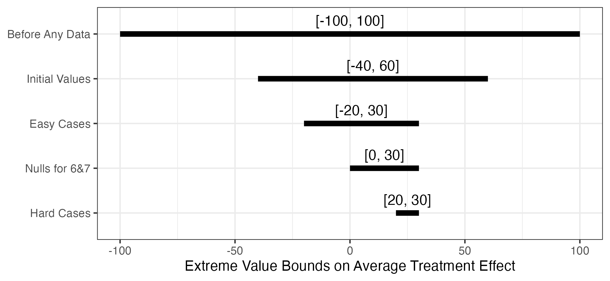
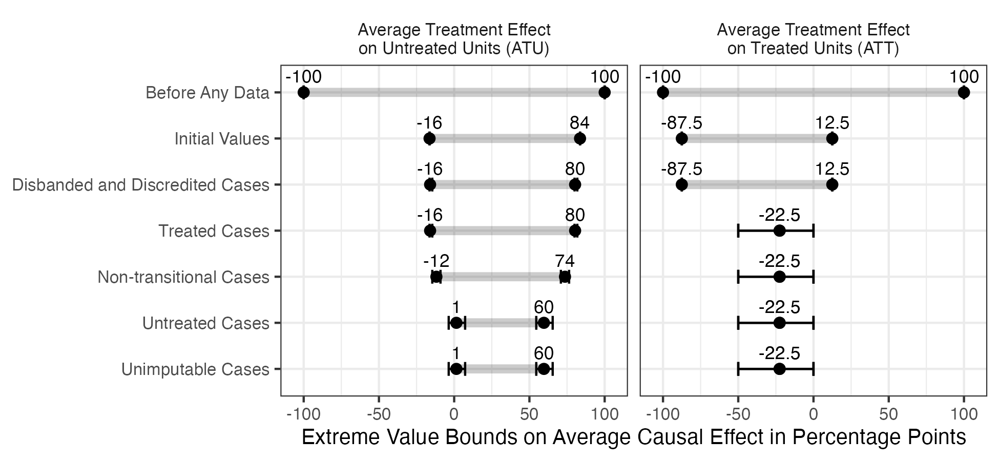
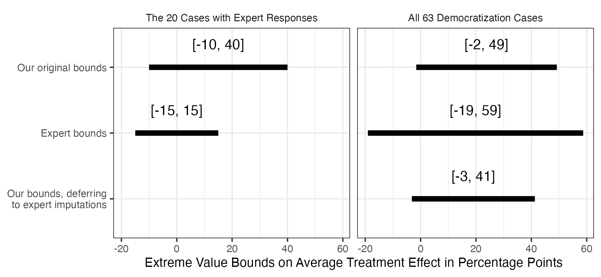
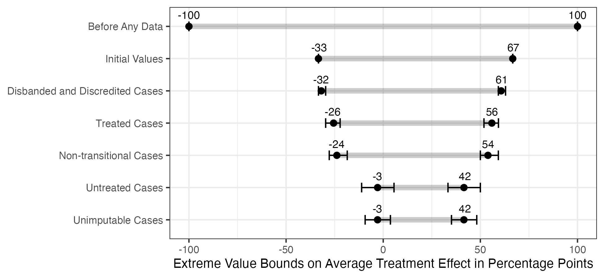
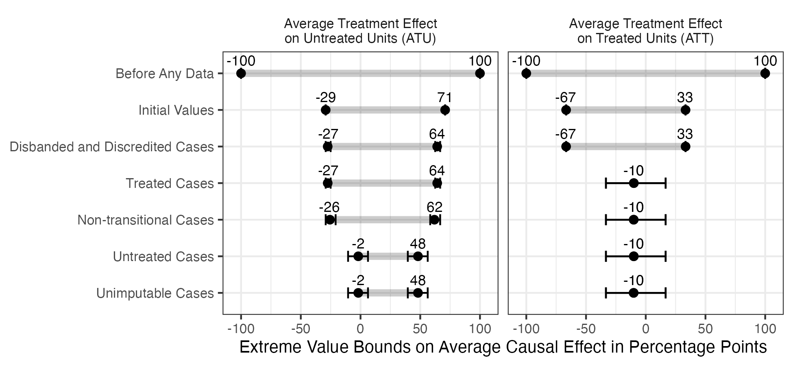

# Active Maintenance Report: coppock_kaur_2022

2026-08-03

- [Summary](#summary)
  - [Does the deposited archive run?](#does-the-deposited-archive-run)
  - [Does the maintained rewrite reproduce the
    paper?](#does-the-maintained-rewrite-reproduce-the-paper)
- [Paper overview](#paper-overview)
- [Original archive reproducibility](#original-archive-reproducibility)
  - [The unseeded simulation, and the bounds it was
    estimating](#the-unseeded-simulation-and-the-bounds-it-was-estimating)
  - [Checksums](#checksums)
- [Errata](#errata)
  - [Entries 1 and 2: seven imputation probabilities the deposit
    transcribes differently from appendix
    C](#entries-1-and-2-seven-imputation-probabilities-the-deposit-transcribes-differently-from-appendix-c)
    - [What it moves](#what-it-moves)
    - [One inconsistency this does not
      resolve](#one-inconsistency-this-does-not-resolve)
  - [Entries 3 and 6 through 10: eight claims in the article’s
    prose](#entries-3-and-6-through-10-eight-claims-in-the-articles-prose)
  - [Two appendix cells the deposit does not
    support](#two-appendix-cells-the-deposit-does-not-support)
- [Number-by-number comparison](#number-by-number-comparison)
  - [Coverage](#coverage)
  - [Appendix Tables B.1 and B.2](#appendix-tables-b1-and-b2)
- [Maintained rewrite](#maintained-rewrite)
  - [Architecture](#architecture)
  - [Deprecated patterns replaced](#deprecated-patterns-replaced)
- [Figures](#figures)
- [Expert survey verification](#expert-survey-verification)
- [In-text quantities](#in-text-quantities)
- [R environment](#r-environment)

*Drafted by Claude Opus 5 under the supervision of Alex Coppock.*

This repository holds the actively maintained replication code for
Coppock and Kaur (2022), together with the reproducibility report that
documents what the original archive did and did not do. It is part of a
program applying the maintenance proposal in Peer, Orr and Coppock
(2021, *PS: Political Science & Politics*, doi
[10.1017/S1049096521000366](https://doi.org/10.1017/S1049096521000366))
to a set of published archives.

|  |  |
|----|----|
| Article | [10.1111/ajps.12697](https://doi.org/10.1111/ajps.12697) |
| Replication archive | [10.7910/DVN/2IVKXD](https://doi.org/10.7910/DVN/2IVKXD) |

**The data are not redistributed here.** The deposit is 10 files and
about 0.7 MB, and lives at Harvard Dataverse, which is the only copy
this repository points at. `download_original.R` fetches it and verifies
every file; `original_manifest.csv` pins the file identifiers, sizes and
checksums, so the exact bytes this code was written against are recorded
in version control even though the bytes themselves are not.

**Repository layout.** `maintained/` is the maintained rewrite: one
script per published table or figure, writing to `output/`, which is
committed so a reader can compare a fresh run against it without
downloading anything. `ground_truth/` ties every published number to the
code that produces it: `published_claims.csv` is the exhaustive list of
numbers the article and its supporting information print, the ground
truth CSV is the comparison against the deposit and against the rewrite,
and `build_ground_truth.R` is the gate that stops the run if a published
number is checked by neither instrument. `coppock_kaur_2022_errata.pdf`
at the root lists the numbers in the article that its own tables,
appendix and data do not support. `original/` is created by the download
script and is deliberately absent from the repository. This file is the
reproducibility report, also available as a PDF in `report/`.

**License.** CC0 1.0 Universal, matching the terms of the deposit this
repository maintains. See `LICENSE`.

**To reproduce.** Clone or download the repository, open
`coppock_kaur_2022.Rproj`, and run:

``` r
source("run_all.R")
```

That fetches the deposit, verifies its 10 files, and produces every
table and figure into `maintained/output/`. Required packages:
tidyverse, janitor, here, and for this report knitr and kableExtra.
Paths resolve through `here`, so nothing depends on the working
directory. Almost all of the run time is in the last two scripts, which
simulate the bounds twenty-one times over in order to say what the
deposited archive’s method gives; the analysis itself is quick. A
successful run overwrites `maintained/output/`, which is committed:
**`git diff` on that folder is the reproduction check.** The figure PDFs
always differ, because a PDF records the time it was written; the CSV
and PNG output comes back byte-identical.

# Summary

Two questions, answered before the detail.

## Does the deposited archive run?

Yes. All five analysis scripts and the helpers file execute without
error on R 4.6.0. Every package the archive names still installs from
CRAN: tidyverse, xtable, janitor and reshape2. Nothing in the archive
has been removed from the language; what has accumulated is deprecation.
`geom_errorbarh()` and the `<ggplot> %+% data` idiom were deprecated in
ggplot2 4.0.0, the `size` aesthetic for lines in 3.4.0, and
`reshape2::melt` and `dcast` are superseded by tidyr. All of them still
work and all of them warn. Everything that stands between this archive
and a clean run is resolvable by substitution.

Running is not the same as reproducing, and one thing keeps the archive
from reproducing its own figures exactly. `figures_2_3_A1_A2.R`
estimates the bounds by simulation, 1,000 draws for Figures 2 and A1 and
10,000 for Figures 3 and A2, and it sets no seed. The published figures
are labelled with rounded percentage points, so most of the simulation
noise is absorbed by the rounding, but not all of it: repeating that
simulation at twenty seeds moves at least one of the 70 labels the four
figures determine off the value the bound actually takes in 14 of them.
A reader running the deposited script today has better than even odds of
seeing a figure that disagrees with the article somewhere, with no error
and no warning. The maintained rewrite does not simulate these bounds at
all, for the reason set out below.

Two smaller things. `table_4.R` prints its bounds as fractions where the
paper prints percentage points, so the deposited output reads `[0, 0.3]`
against the article’s `[0, 30]`. It is a display inconsistency and not a
numerical one. And the writing of every table and figure is commented
out: each script builds the object and prints it, but the `xtable` and
`ggsave` calls that would put it on disk are behind `#`. The archive is
a set of scripts that show their work rather than a pipeline that
produces the article’s floats.

## Does the maintained rewrite reproduce the paper?

Mostly, and the exceptions have one cause. 201 of the 227 verifiable
ground truth claims match the published values to reported precision:
every cell and bound of Table 3, every bound of Figure 1, every row of
Table 4, the democratization row of Table 5, every label of Figures A1
and A2, all ten bounds of Figure 4, 761 of the 763 cells the two
appendix case tables print, the abstract, and every in-text quantity
from the Expert Survey section and Appendix A. The article’s headline
result is among them: the extreme value bounds on the ATE come to \[-2,
49\], 51 points wide, as published. A few of those matching labels are
printed here at one decimal rather than as a whole number, because the
bound falls exactly halfway between two whole numbers and no whole
number states it; each agrees with the published label at the precision
the page prints, and the table under *The unseeded simulation* lists
every one.

The 26 that do not match fall into three groups.

17 of them follow from a single defect in the deposited data, described
in full below: 7 imputation probabilities in `cases_clean.csv` do not
match the probability the article’s own appendix C states for that case,
and the rewrite uses the stated values. Four are labels of Figure 2,
twelve are labels of Figure 3, and one is the sentence summarising the
ATT.

8 are places where the article contradicts itself. Seven of them are
numbers in prose, spread over five sentences, two of which state a pair
of numbers apiece; the rewrite agrees with the table or the appendix the
sentence disagrees with in every case. The eighth is a cell of appendix
Table B.2, an imputation probability the table prints differently from
both appendix C and the deposited data.

The last is a second cell of appendix Table B.2, an observed outcome the
deposited data record differently.

The remaining 5 recorded quantities have no comparison to make: four are
the end-of-conflict row of the imputation summary, which the rewrite
computes and neither the article nor the appendix prints, and one is a
survey fact the deposit never recorded.

All of it is set out with corrected sentences and corrected floats in
`coppock_kaur_2022_errata.pdf` at the root of this repository. **No
conclusion of the article changes.** One published quantity moves
materially: the average treatment effect on the treated, which the
article states as a -15 percentage point effect and which is -22.5
points once the imputation probabilities appendix C states are the ones
the analysis uses.

# Paper overview

**Citation**: Coppock, A. and Kaur, D. (2022). “Qualitative imputation
of missing potential outcomes.” *American Journal of Political Science*,
66(3), 681-695. DOI: 10.1111/ajps.12697

**Summary**: The paper proposes a framework for meta-analysing
qualitative causal inferences. A causal claim about a single case is a
claim about the value of a missing potential outcome, so a set of such
claims can be treated as imputations and fed into Manski (1999) extreme
value bounds, which are the logical range of average causal effects
consistent with what has been observed. Bounds on a binary outcome start
200 percentage points wide and narrow to 100 once the world reveals half
the potential outcomes; each qualitative imputation narrows them
further, and cases too murky to call are left unimputed rather than
guessed. Where the analyst holds a probability rather than a point
belief, the extension enumerates the 2^k consistent worlds and takes the
probability-weighted bounds. The application is to 63 cases eligible for
a transitional truth commission upon democratization, eight of which
received one, with authoritarian resumption within ten years as the
outcome. Imputation in four steps takes the bounds on the ATE to \[-2,
49\], 51 points wide. An email survey of country experts, 20 of whom
responded, supplies an independent set of imputations; deferring to the
experts where they answered narrows the bounds to 44 points. Appendix A
repeats the exercise for 54 end-of-conflict cases.

# Original archive reproducibility

| Script | Status on current R | Resolution |
|:---|:---|:---|
| quimpo_helpers.R | Clean (sourced by the analysis scripts) | %\>% to \|\>, map_df() to map() + bind_rows() |
| table_3_figure_1.R | Runs; deprecation warning | size= to linewidth= |
| table_4.R | Runs clean | Multiply the bounds by 100 to print percentage points, as the paper does |
| table_5.R | Runs clean | recode_factor() to case_when() + factor() |
| figures_2_3_A1_A2.R | Runs; three deprecation warnings; unseeded simulation | melt/dcast to pivot_longer/pivot_wider; geom_errorbarh() to geom_errorbar(orientation=‘y’); %+% to a named plot function; do() to reframe(); the bounds enumerated rather than simulated |
| figure_4.R | Runs; deprecation warning and a melt() id-variable warning | melt to pivot_longer with an explicit names_to; size= to linewidth= |

Original archive reproducibility, checked against R 4.6.0 on 1 August
2026.

## The unseeded simulation, and the bounds it was estimating

The probabilistic extension is what makes Figures 2, 3, A1 and A2
stochastic in the archive. Where the authors hold a probability rather
than a point belief about a missing potential outcome, the deposit’s
`sample_bounds()` draws binary potential outcomes from those
probabilities and recomputes the bounds, and the reported estimate is
the mean over draws. What the archive omits is `set.seed()`, so its
figures are one unlabelled draw.

**The maintained rewrite computes these bounds exactly, where the
deposit estimates them by simulation.** A bound is affine in the
realised imputations: it is the count of realised ones among the imputed
and observed entries, offset by the unimputed entries the bound fills
with a constant, over the number of units. So the distribution the
deposit samples from can be written down and enumerated instead, by
convolving one Bernoulli imputation in at a time, and
`bounds_distribution()` in `maintained/helpers.R` does that. The plotted
estimate is the mean of that distribution and the interval its 2.5th and
97.5th quantiles.

This is not a different estimator. It is the same quantity by a
different route, and it is the route the paper itself takes for the toy
example, whose Table 4 enumerates all four consistent worlds and takes
the probability-weighted bounds rather than sampling them. What it
changes is threefold. Nothing in this repository depends on a seed, so
the reproduction check is a byte comparison rather than a judgment about
noise. The 84 bounds the four figures carry are now stated at their
exact values rather than to within the simulation’s error, which at the
deposit’s number of draws reaches 0.33 points at one of them. And a
bound that falls exactly halfway between two whole numbers becomes
visible as such, instead of being settled by whichever side a draw
happened to land on.

`maintained/text_expected_bounds.R` keeps the comparison against the
deposit’s own method on the record: it runs that simulation once at a
fixed seed, writes what it gives beside the exact value, and stops the
build if any of the 84 bounds disagree by more than five standard errors
of the simulated estimate. `maintained/text_seed_sensitivity.R` runs it
at twenty seeds.

| Labels rounded differently | Seeds |
|---------------------------:|------:|
|                          0 |     6 |
|                          1 |     8 |
|                          2 |     3 |
|                          3 |     3 |

The deposited archive’s method, repeated at twenty seeds. Of the labels
the four figures carry, the number the simulation rounds to a different
whole number than the bound it is estimating does.

The size of the disturbance is one percentage point in the label, never
more, and it barely touches the substantive claims: the final
democratization bounds read \[-2, 49\] at 17 of the 20 seeds and \[-1,
49\] at the other 3, a difference of one point in the lower label. The
point is not that the archive gets a different answer but that it gets a
slightly different figure each time it is run, and it offers a reader no
way to tell whether a discrepancy is noise or a mistake.

The table above counts only the 70 labels a whole number can state. The
other 14 fall exactly halfway between two of them, and for those the
deposit’s method prints whichever side the draw fell on. The maintained
figures print such a bound at the one decimal that states it.

| Sample | Estimand | Step | Exact bound | Simulated, at seed 12345 |
|:---|:---|:---|:---|:---|
| Democratization | ATT | Initial Values | \[-87.5, 12.5\] | \[-88, 12\] |
| Democratization | ATT | Disbanded and Discredited Cases | \[-87.5, 12.5\] | \[-88, 12\] |
| Democratization | ATT | Treated Cases | \[-22.5, -22.5\] | \[-22, -22\] |
| Democratization | ATT | Non-transitional Cases | \[-22.5, -22.5\] | \[-23, -23\] |
| Democratization | ATT | Untreated Cases | \[-22.5, -22.5\] | \[-22, -22\] |
| Democratization | ATT | Unimputable Cases | \[-22.5, -22.5\] | \[-22, -22\] |
| End of conflict | ATU | Disbanded and Discredited Cases | \[-27.5, 64.2\] | \[-27, 64\] |
| End of conflict | ATU | Treated Cases | \[-27.5, 64.2\] | \[-28, 64\] |

Bounds falling on a whole-number rounding boundary, with what one run of
the deposit’s method gives for the same quantity. All but the
democratization ATT rows from Treated Cases onwards are a property of
the deposit as published; those appear once the appendix C probabilities
are restored.

The 4 democratization ATT rows from *Treated Cases* onwards are the
consequential ones, and they are the only rows in the table the
corrections create. The ATT is exactly -22.5 once South Africa carries
the probability appendix C states for it, so a whole-number label for it
is not decided by the estimate at all: over twenty seeds the deposit’s
method prints \[-22, -22\] at 12 and \[-23, -23\] at 8. The rest of the
table was on a boundary in the deposit as published, and the labels the
article prints for them are one draw of a coin flip.

## Checksums

| File                     |  Bytes | MD5 served (first 12) | Published MD5 agrees |
|:-------------------------|-------:|:----------------------|:---------------------|
| cases_clean.csv          |  21433 | 0a238c073307          | yes                  |
| codebook_cases_clean.pdf | 348561 | 87154446febf          | yes                  |
| figure_4.R               |   4282 | d62dbb3dc25a          | yes                  |
| figures_2_3_A1_A2.R      |   5859 | b06b1c39bfba          | yes                  |
| logfile.html             | 278521 | 831c13a4b09c          | yes                  |
| quimpo_helpers.R         |   1517 | 876ec89e03d6          | yes                  |
| README.txt               |   1712 | 634560b77b47          | yes                  |
| table_3_figure_1.R       |   3456 | e8fb68e7b478          | yes                  |
| table_4.R                |   2220 | 237c27908efb          | yes                  |
| table_5.R                |   1184 | fd0efb3ad0e6          | yes                  |

The deposit as Dataverse serves it with ?format=original. All ten files
match the checksums Dataverse publishes, and all ten match the copy this
program downloaded in March 2026.

Harvard Dataverse ingests `cases_clean.csv` as tabular data and derives
a `.tab` representation from it, so the manifest records
`originalFileName` and `originalFileSize` rather than the derived names
and sizes, and `download_original.R` asks for `?format=original`. The
published MD5 describes the deposited bytes, not the derived ones, and
here it verifies them exactly. Other deposits in this program carry
published checksums that verify neither file, so the download script
checks against the served checksum and reports any published
disagreement rather than failing on it.

# Errata

Nothing in the deposited code is wrong. The deposited data are wrong in
seven cells, and eight claims in the article’s prose, spread over six
sentences, are wrong on the article’s own terms. All of it is set out
with corrected sentences and corrected floats as eighteen numbered
entries in `coppock_kaur_2022_errata.pdf` at the root of this
repository. None of it changes a conclusion. The sections below carry
the note’s numbering.

## Entries 1 and 2: seven imputation probabilities the deposit transcribes differently from appendix C

The imputed potential outcomes in this article are not measurements.
They are qualitative judgments about what would have happened in each
case, set out one by one in appendix C with the scholarship behind each
of them, and the deposited `cases_clean.csv` is a transcription of those
judgments. Appendix C states an imputation probability for 30 of the 31
imputed democratization cases; the exception, Thailand (1991-1992),
refers to the entry above it rather than stating a number of its own.
Twenty-three of the 30 agree with the deposit exactly. 7 do not.

| Case | Appendix C entry | Imputed value | Probability in the deposit | Probability in appendix C |
|:---|:---|---:|:---|:---|
| South Africa (1910-1994) | C.2.7 | 1 | 0.2 | 0.8 |
| Ghana (1981-1993) | C.3.2 | 0 | 0.1 | 0.2 |
| Uruguay (1973-1984) | C.3.6 | 1 | 1 | 0.9 |
| Sierra Leone (1997-1998) | C.4.8 | 0 | 0.2 | 0.1 |
| Nicaragua (1979-1990) | C.4.10 | 1 | 0.8 | 0.9 |
| Central African Rep (1981-1993) | C.4.12 | 1 | 0.3 | 0.7 |
| Sierra Leone (1992-1996) | C.4.13 | 1 | 0.3 | 0.7 |

The imputation probabilities the deposited case file transcribes
differently from the appendix C narrative that states them. The imputed
value is the point imputation, which agrees with appendix C in every
case.

3 of the 7 are exact complements, and in all three the deposit
contradicts itself: an imputed potential outcome of 1 sits beside a
probability below one half, which says the imputation is more likely to
be 0 than 1. The main text states the South Africa probability too, on
page 10, and states it as 0.8. The other 4 differ from the stated
probability by one step of 0.1 and none of them crosses one half, so
none changes an imputed value.

Appendix Table B.2 prints the deposited value in all 7 cases, so the
published table inherits the transcription error rather than committing
a second one. `maintained/table_b1_b2_case_dataset.R` is the one script
in the rewrite that reads the deposit rather than the corrected file,
precisely so that this stays checkable: the question those two tables
answer is whether the published pages print what the deposit holds, and
they do.

**The rewrite uses the values appendix C states.**
`maintained/apply_appendix_c_corrections.R` is a visible, named step
that writes both the corrected case file every analysis script reads and
`output/appendix_c_corrections.csv`, the table above, so the deposited
value sits beside the value that replaced it. It asserts the deposited
value in every column it touches before overwriting it, so a change to
the deposit stops the run rather than being absorbed. The probability
columns are cumulative, and each correction is applied to every step
column from the step at which the case is imputed onwards.

### What it moves

The article’s headline result is unchanged. The extreme value bounds on
the ATE stay at \[-2, 49\] and 51 points wide, as do the abstract’s
three numbers, the expert survey comparison in Figure 4, Table 5, and
every quantity in the end-of-conflict application, all seven corrections
being democratization cases. The two intermediate steps of Figure 2 move
by about one point in each label, and the ATU bounds of Figure 3 by
about one and a half.

The consequential movement is in the ATT. Every treated case has both
potential outcomes filled in by the second imputation step, which is why
the ATT bounds collapse to a point, and South Africa is one of the eight
treated cases. Restoring its probability from 0.2 to the 0.8 that both
the main text and appendix C state moves the ATT from -15 to -22.5
percentage points.

| Quantity | Published | Corrected |
|:---|:---|:---|
| Figure 2, Treated Cases | \[-16, 68\] | \[-16.8, 67.3\] |
| Figure 2, Non-transitional Cases | \[-12, 62\] | \[-13.2, 61.4\] |
| Figure 2, Untreated and Unimputable Cases | \[-2, 49\] | \[-1.6, 49.2\] |
| Figure 3, ATU, Untreated and Unimputable Cases | \[0, 58\] | \[1.5, 59.6\] |
| Figure 3, ATT, Treated Cases onwards | \[-15, -15\] | \[-22.5, -22.5\] |

Every published bound the corrections move. Published values are the
whole-number labels the figures carry; corrected values are exact. The
third row is the article’s headline result and rounds to the published
label.

The article’s ATU claim is untouched. It says the ATU bounds are
“greater than 58 points wide”, and that width is 58.2 points before the
correction and after it, because both ATU bounds move by the same
amount.

One imputation changes class. An imputation is made with certainty when
its probability is exactly 0 or exactly 1, and Uruguay (1973-1984) is
carried at 1 in the deposit where appendix C entry C.3.6 states 0.9. The
split the article states as “5 with certainty, 26 probabilistically” is
4 and 27 in the deposit, Uruguay being the difference, and 3 and 28 once
appendix C is followed. The number left unimputed, 32, and the 31
imputed in total are the same either way.

### One inconsistency this does not resolve

South Africa - Namibia (1966-1988), an end-of-conflict case, is the
fourth place in the deposited data where a point imputation sits on the
wrong side of its own probability: the imputed treated outcome is 0 and
the probability that it equals 1 is 0.8. Appendix Table B.1 prints the
same pair, so the table and the deposit agree. Appendix C covers the
democratization cases only and Appendix A gives no case-by-case
narrative for the end-of-conflict sample, so there is no stated
probability anywhere to resolve it against, and the case is left exactly
as deposited. The three democratization cases of the same shape are
corrected above, because for those a stated probability exists.

## Entries 3 and 6 through 10: eight claims in the article’s prose

**Entry 7, the toy example’s treated outcomes.** The text introducing
the toy example says “the outcome for three of the treated units and one
of the untreated units is 1”. Table 3 on the facing page shows units 1
through 4 treated with an observed outcome of 1, which is four, and the
deposited `Y <- rep(c(1, 0, 1, 0), c(4, 3, 1, 2))` encodes four. Four is
also what the bounds require: the initial bounds of \[-40, 60\] follow
from four treated ones and would be \[-50, 50\] with three.

**Entry 8, the probabilistic extension’s probabilities.** The text says
that instead of imputing 0 for units 6 and 7, “we think the
probabilities of being a ‘1’ for units 6 and 7 are .3 and .4”. Table 4
gives the four scenario probabilities as 0.56, 0.14, 0.24 and 0.06,
which is the product distribution of 0.2 and 0.3, not of 0.3 and 0.4,
which would give 0.42, 0.18, 0.28 and 0.12. The deposited `table_4.R`
uses 0.2 and 0.3 and reproduces Table 4 exactly, as does the rewrite.

**Entry 9, Appendix A’s bounds width.** Appendix A says the imputations
shrink “the width of the extreme value bounds from 100 to 41 points” and
then, in the next sentence, that “the bounds come to \[-3, 42\] (only 45
points wide)”. Both cannot hold. The pipeline gives final
end-of-conflict bounds of \[-2.9, 41.5\], a width of 44.4 points, which
rounds to 44 and which is 45 if taken as the difference of the rounded
endpoints, as the second sentence does. The 41 matches nothing.

**Entry 6, how the 63 missing potential outcomes were imputed.** The
empirical section says “for all 63 unobserved potential outcomes, we
imputed 5 with certainty, 26 probabilistically and we left 32
unimputed”. Neither number holds under either reading of the data, as
set out above. The 32 left unimputed and the 31 imputed in total are
right.

**Entry 10, the count of disbanded and discredited cases.** Step 1 names
two democratization cases, Bolivia and the Philippines, then says in the
next sentence that “the observed outcome $Y_i(0)$ in each of these four
cases was 0”. Appendix Table B.2 lists two cases at that step. Appendix
Table B.1 lists four end-of-conflict cases at the same step, which is
where the count appears to have come from.

**Entry 3, the ATT.** “We can summarize the ATT as a -15 percentage
point effect on return to authoritarianism.” That is what the deposited
data give; it is -22.5 under the appendix C probabilities.

## Two appendix cells the deposit does not support

Appendix Tables B.1 and B.2 print the full case datasets, 763 cells
between them, and the deposited case file reproduces 761.

**Burundi’s imputation probability.** Table B.2 prints the imputed
treated outcome for Burundi (1996-2005) as 1 with a probability of 0.9.
Appendix C entry C.4.11 states 0.8 for the same case, and the deposited
data carry 0.8. Deposit and appendix agree here, so there is nothing to
correct in the data; the table cell is the outlier and no bound is
affected.

**Azerbaijan’s observed outcome.** Table B.2 prints an observed outcome
of 0 for Azerbaijan (1991-1992), consistent with the untreated potential
outcome of 0 printed beside it. The deposited `outcome` column records 1
for that case while its `y0_obs` column records 0, so the deposit
contradicts the switching equation for this one case. Nothing in the
analysis reads the `outcome` column, so nothing published depends on it,
and the table matches what the analysis used.

# Number-by-number comparison

| Location | Quantity | Paper | Archive | Rewrite | Match | Match (rw) |
|:---|:---|:---|:---|:---|:---|:---|
| table_3 | column d | 1,1,1,1,1,1,1,0,0,0 | 1,1,1,1,1,1,1,0,0,0 | 1,1,1,1,1,1,1,0,0,0 | 1 | 1 |
| table_3 | column Y | 1,1,1,1,0,0,0,1,0,0 | 1,1,1,1,0,0,0,1,0,0 | 1,1,1,1,0,0,0,1,0,0 | 1 | 1 |
| table_3 | column Y0_initial | ?,?,?,?,?,?,?,1,0,0 | ?,?,?,?,?,?,?,1,0,0 | ?,?,?,?,?,?,?,1,0,0 | 1 | 1 |
| table_3 | column Y1_initial | 1,1,1,1,0,0,0,?,?,? | 1,1,1,1,0,0,0,?,?,? | 1,1,1,1,0,0,0,?,?,? | 1 | 1 |
| table_3 | column Y0_easy | 1,1,?,?,0,?,?,1,0,0 | 1,1,?,?,0,?,?,1,0,0 | 1,1,?,?,0,?,?,1,0,0 | 1 | 1 |
| table_3 | column Y1_easy | 1,1,1,1,0,0,0,1,0,? | 1,1,1,1,0,0,0,1,0,? | 1,1,1,1,0,0,0,1,0,? | 1 | 1 |
| table_3 | column Y0_nulls | 1,1,?,?,0,0,0,1,0,0 | 1,1,?,?,0,0,0,1,0,0 | 1,1,?,?,0,0,0,1,0,0 | 1 | 1 |
| table_3 | column Y1_nulls | 1,1,1,1,0,0,0,1,0,? | 1,1,1,1,0,0,0,1,0,? | 1,1,1,1,0,0,0,1,0,? | 1 | 1 |
| table_3 | column Y0_hard | 1,1,0,0,0,0,0,1,0,0 | 1,1,0,0,0,0,0,1,0,0 | 1,1,0,0,0,0,0,1,0,0 | 1 | 1 |
| table_3 | column Y1_hard | 1,1,1,1,0,0,0,1,0,? | 1,1,1,1,0,0,0,1,0,? | 1,1,1,1,0,0,0,1,0,? | 1 | 1 |
| table_3 | EV bounds low, Initial Values | -40 | -40 | -40 | 1 | 1 |
| table_3 | EV bounds high, Initial Values | 60 | 60 | 60 | 1 | 1 |
| table_3 | EV bounds low, Easy Cases | -20 | -20 | -20 | 1 | 1 |
| table_3 | EV bounds high, Easy Cases | 30 | 30 | 30 | 1 | 1 |
| table_3 | EV bounds low, Nulls for 6&7 | 0 | 0 | 0 | 1 | 1 |
| table_3 | EV bounds high, Nulls for 6&7 | 30 | 30 | 30 | 1 | 1 |
| table_3 | EV bounds low, Hard Cases | 20 | 20 | 20 | 1 | 1 |
| table_3 | EV bounds high, Hard Cases | 30 | 30 | 30 | 1 | 1 |
| figure_1 | low bound, Before Any Data | -100 | -100 | -100 | 1 | 1 |
| figure_1 | high bound, Before Any Data | 100 | 100 | 100 | 1 | 1 |
| figure_1 | low bound, Initial Values | -40 | -40 | -40 | 1 | 1 |
| figure_1 | high bound, Initial Values | 60 | 60 | 60 | 1 | 1 |
| figure_1 | low bound, Easy Cases | -20 | -20 | -20 | 1 | 1 |
| figure_1 | high bound, Easy Cases | 30 | 30 | 30 | 1 | 1 |
| figure_1 | low bound, Nulls for 6&7 | 0 | 0 | 0 | 1 | 1 |
| figure_1 | high bound, Nulls for 6&7 | 30 | 30 | 30 | 1 | 1 |
| figure_1 | low bound, Hard Cases | 20 | 20 | 20 | 1 | 1 |
| figure_1 | high bound, Hard Cases | 30 | 30 | 30 | 1 | 1 |
| table_4 | EV bounds low, unit 6 = 0, unit 7 = 0 | 0 | 0 | 0 | 1 | 1 |
| table_4 | EV bounds high, unit 6 = 0, unit 7 = 0 | 30 | 30 | 30 | 1 | 1 |
| table_4 | probability, unit 6 = 0, unit 7 = 0 | 0.56 | 0.56 | 0.56 | 1 | 1 |
| table_4 | EV bounds low, unit 6 = 1, unit 7 = 0 | -10 | -10 | -10 | 1 | 1 |
| table_4 | EV bounds high, unit 6 = 1, unit 7 = 0 | 20 | 20 | 20 | 1 | 1 |
| table_4 | probability, unit 6 = 1, unit 7 = 0 | 0.14 | 0.14 | 0.14 | 1 | 1 |
| table_4 | EV bounds low, unit 6 = 0, unit 7 = 1 | -10 | -10 | -10 | 1 | 1 |
| table_4 | EV bounds high, unit 6 = 0, unit 7 = 1 | 20 | 20 | 20 | 1 | 1 |
| table_4 | probability, unit 6 = 0, unit 7 = 1 | 0.24 | 0.24 | 0.24 | 1 | 1 |
| table_4 | EV bounds low, unit 6 = 1, unit 7 = 1 | -20 | -20 | -20 | 1 | 1 |
| table_4 | EV bounds high, unit 6 = 1, unit 7 = 1 | 10 | 10 | 10 | 1 | 1 |
| table_4 | probability, unit 6 = 1, unit 7 = 1 | 0.06 | 0.06 | 0.06 | 1 | 1 |
| table_4 | probability-weighted point estimate, lower bound | -5 |  | -5 |  | 1 |
| table_4 | probability-weighted point estimate, upper bound | 25 |  | 25 |  | 1 |
| table_4 | 2.5th quantile of the lower bound | -20 |  | -20 |  | 1 |
| table_4 | 97.5th quantile of the lower bound | 0 |  | 0 |  | 1 |
| table_4 | 2.5th quantile of the upper bound | 10 |  | 10 |  | 1 |
| table_4 | 97.5th quantile of the upper bound | 30 |  | 30 |  | 1 |
| table_4 | probability that unit 6 has Y0 = 1 | 0.3 | 0.2 | 0.2 | 0 | 0 |
| table_4 | probability that unit 7 has Y0 = 1 | 0.4 | 0.3 | 0.3 | 0 | 0 |
| table_5 | democratization, Negative Effect | 2% (1) | 2% (1) | 2% (1) | 1 | 1 |
| table_5 | end of conflict, Negative Effect |  | 0% (0) | 0% (0) |  |  |
| table_5 | democratization, No Effect | 40% (25) | 40% (25) | 40% (25) | 1 | 1 |
| table_5 | end of conflict, No Effect |  | 43% (23) | 43% (23) |  |  |
| table_5 | democratization, Positive Effect | 8% (5) | 8% (5) | 8% (5) | 1 | 1 |
| table_5 | end of conflict, Positive Effect |  | 13% (7) | 13% (7) |  |  |
| table_5 | democratization, Unimputed | 51% (32) | 51% (32) | 51% (32) | 1 | 1 |
| table_5 | end of conflict, Unimputed |  | 44% (24) | 44% (24) |  |  |
| figure_2 | low bound, Before Any Data | -100 | -100 | -100 | 1 | 1 |
| figure_2 | high bound, Before Any Data | 100 | 100 | 100 | 1 | 1 |
| figure_2 | low bound, Initial Values | -25 | -25 | -25 | 1 | 1 |
| figure_2 | high bound, Initial Values | 75 | 75 | 75 | 1 | 1 |
| figure_2 | low bound, Disbanded and Discredited Cases | -25 | -25 | -25 | 1 | 1 |
| figure_2 | high bound, Disbanded and Discredited Cases | 72 | 72 | 72 | 1 | 1 |
| figure_2 | low bound, Treated Cases | -16 | -16 | -17 | 1 | 0 |
| figure_2 | high bound, Treated Cases | 68 | 68 | 67 | 1 | 0 |
| figure_2 | low bound, Non-transitional Cases | -12 | -12 | -13 | 1 | 0 |
| figure_2 | high bound, Non-transitional Cases | 62 | 62 | 61 | 1 | 0 |
| figure_2 | low bound, Untreated Cases | -2 | -2 | -2 | 1 | 1 |
| figure_2 | high bound, Untreated Cases | 49 | 49 | 49 | 1 | 1 |
| figure_2 | low bound, Unimputable Cases | -2 | -2 | -2 | 1 | 1 |
| figure_2 | high bound, Unimputable Cases | 49 | 49 | 49 | 1 | 1 |
| figure_a1 | low bound, Before Any Data | -100 | -100 | -100 | 1 | 1 |
| figure_a1 | high bound, Before Any Data | 100 | 100 | 100 | 1 | 1 |
| figure_a1 | low bound, Initial Values | -33 | -33 | -33 | 1 | 1 |
| figure_a1 | high bound, Initial Values | 67 | 67 | 67 | 1 | 1 |
| figure_a1 | low bound, Disbanded and Discredited Cases | -32 | -32 | -32 | 1 | 1 |
| figure_a1 | high bound, Disbanded and Discredited Cases | 61 | 61 | 61 | 1 | 1 |
| figure_a1 | low bound, Treated Cases | -26 | -26 | -26 | 1 | 1 |
| figure_a1 | high bound, Treated Cases | 56 | 56 | 56 | 1 | 1 |
| figure_a1 | low bound, Non-transitional Cases | -24 | -24 | -24 | 1 | 1 |
| figure_a1 | high bound, Non-transitional Cases | 54 | 54 | 54 | 1 | 1 |
| figure_a1 | low bound, Untreated Cases | -3 | -3 | -3 | 1 | 1 |
| figure_a1 | high bound, Untreated Cases | 42 | 42 | 42 | 1 | 1 |
| figure_a1 | low bound, Unimputable Cases | -3 | -3 | -3 | 1 | 1 |
| figure_a1 | high bound, Unimputable Cases | 42 | 42 | 42 | 1 | 1 |
| figure_3 | low bound, ATU, Before Any Data | -100 | -100 | -100 | 1 | 1 |
| figure_3 | high bound, ATU, Before Any Data | 100 | 100 | 100 | 1 | 1 |
| figure_3 | low bound, ATU, Initial Values | -16 | -16 | -16 | 1 | 1 |
| figure_3 | high bound, ATU, Initial Values | 84 | 84 | 84 | 1 | 1 |
| figure_3 | low bound, ATU, Disbanded and Discredited Cases | -16 | -16 | -16 | 1 | 1 |
| figure_3 | high bound, ATU, Disbanded and Discredited Cases | 80 | 80 | 80 | 1 | 1 |
| figure_3 | low bound, ATU, Treated Cases | -16 | -16 | -16 | 1 | 1 |
| figure_3 | high bound, ATU, Treated Cases | 80 | 80 | 80 | 1 | 1 |
| figure_3 | low bound, ATU, Non-transitional Cases | -12 | -12 | -12 | 1 | 1 |
| figure_3 | high bound, ATU, Non-transitional Cases | 74 | 74 | 74 | 1 | 1 |
| figure_3 | low bound, ATU, Untreated Cases | 0 | 0 | 1 | 1 | 0 |
| figure_3 | high bound, ATU, Untreated Cases | 58 | 58 | 60 | 1 | 0 |
| figure_3 | low bound, ATU, Unimputable Cases | 0 | 0 | 1 | 1 | 0 |
| figure_3 | high bound, ATU, Unimputable Cases | 58 | 58 | 60 | 1 | 0 |
| figure_3 | low bound, ATT, Before Any Data | -100 | -100 | -100 | 1 | 1 |
| figure_3 | high bound, ATT, Before Any Data | 100 | 100 | 100 | 1 | 1 |
| figure_3 | low bound, ATT, Initial Values | -88 | -88 | -87.5 | 1 | 1 |
| figure_3 | high bound, ATT, Initial Values | 12 | 12 | 12.5 | 1 | 1 |
| figure_3 | low bound, ATT, Disbanded and Discredited Cases | -88 | -88 | -87.5 | 1 | 1 |
| figure_3 | high bound, ATT, Disbanded and Discredited Cases | 12 | 12 | 12.5 | 1 | 1 |
| figure_3 | low bound, ATT, Treated Cases | -15 | -15 | -22.5 | 1 | 0 |
| figure_3 | high bound, ATT, Treated Cases | -15 | -15 | -22.5 | 1 | 0 |
| figure_3 | low bound, ATT, Non-transitional Cases | -15 | -15 | -22.5 | 1 | 0 |
| figure_3 | high bound, ATT, Non-transitional Cases | -15 | -15 | -22.5 | 1 | 0 |
| figure_3 | low bound, ATT, Untreated Cases | -15 | -15 | -22.5 | 1 | 0 |
| figure_3 | high bound, ATT, Untreated Cases | -15 | -15 | -22.5 | 1 | 0 |
| figure_3 | low bound, ATT, Unimputable Cases | -15 | -15 | -22.5 | 1 | 0 |
| figure_3 | high bound, ATT, Unimputable Cases | -15 | -15 | -22.5 | 1 | 0 |
| figure_a2 | low bound, ATU, Before Any Data | -100 | -100 | -100 | 1 | 1 |
| figure_a2 | high bound, ATU, Before Any Data | 100 | 100 | 100 | 1 | 1 |
| figure_a2 | low bound, ATU, Initial Values | -29 | -29 | -29 | 1 | 1 |
| figure_a2 | high bound, ATU, Initial Values | 71 | 71 | 71 | 1 | 1 |
| figure_a2 | low bound, ATU, Disbanded and Discredited Cases | -27 | -27 | -27.5 | 1 | 1 |
| figure_a2 | high bound, ATU, Disbanded and Discredited Cases | 64 | 64 | 64 | 1 | 1 |
| figure_a2 | low bound, ATU, Treated Cases | -27 | -27 | -27.5 | 1 | 1 |
| figure_a2 | high bound, ATU, Treated Cases | 64 | 64 | 64 | 1 | 1 |
| figure_a2 | low bound, ATU, Non-transitional Cases | -26 | -26 | -26 | 1 | 1 |
| figure_a2 | high bound, ATU, Non-transitional Cases | 62 | 62 | 62 | 1 | 1 |
| figure_a2 | low bound, ATU, Untreated Cases | -2 | -2 | -2 | 1 | 1 |
| figure_a2 | high bound, ATU, Untreated Cases | 48 | 48 | 48 | 1 | 1 |
| figure_a2 | low bound, ATU, Unimputable Cases | -2 | -2 | -2 | 1 | 1 |
| figure_a2 | high bound, ATU, Unimputable Cases | 48 | 48 | 48 | 1 | 1 |
| figure_a2 | low bound, ATT, Before Any Data | -100 | -100 | -100 | 1 | 1 |
| figure_a2 | high bound, ATT, Before Any Data | 100 | 100 | 100 | 1 | 1 |
| figure_a2 | low bound, ATT, Initial Values | -67 | -67 | -67 | 1 | 1 |
| figure_a2 | high bound, ATT, Initial Values | 33 | 33 | 33 | 1 | 1 |
| figure_a2 | low bound, ATT, Disbanded and Discredited Cases | -67 | -67 | -67 | 1 | 1 |
| figure_a2 | high bound, ATT, Disbanded and Discredited Cases | 33 | 33 | 33 | 1 | 1 |
| figure_a2 | low bound, ATT, Treated Cases | -10 | -10 | -10 | 1 | 1 |
| figure_a2 | high bound, ATT, Treated Cases | -10 | -10 | -10 | 1 | 1 |
| figure_a2 | low bound, ATT, Non-transitional Cases | -10 | -10 | -10 | 1 | 1 |
| figure_a2 | high bound, ATT, Non-transitional Cases | -10 | -10 | -10 | 1 | 1 |
| figure_a2 | low bound, ATT, Untreated Cases | -10 | -10 | -10 | 1 | 1 |
| figure_a2 | high bound, ATT, Untreated Cases | -10 | -10 | -10 | 1 | 1 |
| figure_a2 | low bound, ATT, Unimputable Cases | -10 | -10 | -10 | 1 | 1 |
| figure_a2 | high bound, ATT, Unimputable Cases | -10 | -10 | -10 | 1 | 1 |
| figure_4 | low bound, us, The 20 Cases with Expert Responses | -10 | -10 | -10 | 1 | 1 |
| figure_4 | high bound, us, The 20 Cases with Expert Responses | 40 | 40 | 40 | 1 | 1 |
| figure_4 | low bound, expert, The 20 Cases with Expert Responses | -15 | -15 | -15 | 1 | 1 |
| figure_4 | high bound, expert, The 20 Cases with Expert Responses | 15 | 15 | 15 | 1 | 1 |
| figure_4 | low bound, us, All 63 Democratization Cases | -2 | -2 | -2 | 1 | 1 |
| figure_4 | high bound, us, All 63 Democratization Cases | 49 | 49 | 49 | 1 | 1 |
| figure_4 | low bound, expert, All 63 Democratization Cases | -19 | -19 | -19 | 1 | 1 |
| figure_4 | high bound, expert, All 63 Democratization Cases | 59 | 59 | 59 | 1 | 1 |
| figure_4 | low bound, combined, All 63 Democratization Cases | -3 | -3 | -3 | 1 | 1 |
| figure_4 | high bound, combined, All 63 Democratization Cases | 41 | 41 | 41 | 1 | 1 |
| abstract | bounds width prior to any analysis | 100 | 100 | 100 | 1 | 1 |
| abstract | bounds width after imputation | 51 | 51 | 51 | 1 | 1 |
| abstract | bounds width after the expert survey | 44 | 44 | 44 | 1 | 1 |
| text | democratization cases | 63 | 63 | 63 | 1 | 1 |
| text | treated democratization cases | 8 | 8 | 8 | 1 | 1 |
| text | bounds width before any data are collected | 200 | 200 | 200 | 1 | 1 |
| text | bounds width once half the potential outcomes are revealed | 100 | 100 | 100 | 1 | 1 |
| text | final ATE lower bound | -2 | -2 | -2 | 1 | 1 |
| text | final ATE upper bound | 49 | 49 | 49 | 1 | 1 |
| text | final ATE bounds width | 51 | 51 | 51 | 1 | 1 |
| text | toy example: treated units with outcome 1 | 3 | 4 | 4 | 0 | 0 |
| text | toy example: untreated units with outcome 1 | 1 | 1 | 1 | 1 | 1 |
| text | toy example: bounds width before any data | 200 | 200 | 200 | 1 | 1 |
| text | toy example: final bounds width | 10 | 10 | 10 | 1 | 1 |
| text | ATU final bounds width | 58 | 58 | 58 | 1 | 1 |
| text | ATT summarised as a point effect | -15 | -15 | -22.5 | 1 | 0 |
| text | cases imputed as a non-zero causal effect | 6 | 6 | 6 | 1 | 1 |
| text | expert responses received | 20 | 20 | 20 | 1 | 1 |
| text | democratization cases without an expert response | 43 | 43 | 43 | 1 | 1 |
| text | our bounds width, 20 responding cases | 50 | 50 | 50 | 1 | 1 |
| text | expert bounds width, 20 responding cases | 30 | 30 | 30 | 1 | 1 |
| text | our bounds width, all 63 cases | 51 | 51 | 51 | 1 | 1 |
| text | expert bounds width, all 63 cases | 78 | 78 | 78 | 1 | 1 |
| text | combined bounds width, all 63 cases | 44 | 44 | 44 | 1 | 1 |
| text | expert and author imputations agreed | 7 | 7 | 7 | 1 | 1 |
| text | expert and author imputations conflicted | 3 | 3 | 3 | 1 | 1 |
| text | we imputed, the experts did not | 3 | 3 | 3 | 1 | 1 |
| text | the experts imputed, we did not | 7 | 7 | 7 | 1 | 1 |
| text | cases the experts imputed | 14 | 14 | 14 | 1 | 1 |
| text | cases we imputed | 10 | 10 | 10 | 1 | 1 |
| text | experts who declined to impute | 6 | 6 | 6 | 1 | 1 |
| text | declining experts assigned to an untreated case | 6 | 6 | 6 | 1 | 1 |
| text | expert imputations differing from the observed outcome | 0 | 0 | 0 | 1 | 1 |
| appendix_a | end-of-conflict cases | 54 | 54 | 54 | 1 | 1 |
| appendix_a | treated end-of-conflict cases | 6 | 6 | 6 | 1 | 1 |
| appendix_a | bounds width once half the potential outcomes are revealed | 100 | 100 | 100 | 1 | 1 |
| appendix_a | bounds width after imputation | 41 | 44 | 44 | 0 | 0 |
| appendix_a | final ATE lower bound | -3 | -3 | -3 | 1 | 1 |
| appendix_a | final ATE upper bound | 42 | 42 | 42 | 1 | 1 |
| appendix_a | final ATE bounds width from the rounded endpoints | 45 | 45 | 45 | 1 | 1 |
| appendix_a | ATT summarised as a point effect | -10 | -10 | -10 | 1 | 1 |
| text | toy example: units | 10 |  | 10 |  | 1 |
| text | toy example: treated units | 7 |  | 7 |  | 1 |
| text | toy example: untreated units | 3 |  | 3 |  | 1 |
| text | toy example: easy imputations | 5 |  | 5 |  | 1 |
| text | toy example: untreated outcomes for units 1, 2 and 5 | 1, 1, 0 |  | 1, 1, 0 |  | 1 |
| text | toy example: treated outcomes for units 8 and 9 | 1, 0 |  | 1, 0 |  | 1 |
| text | probabilistic extension: possible sets of potential outcomes | 4 |  | 4 |  | 1 |
| text | unobserved potential outcomes | 63 |  | 63 |  | 1 |
| text | unobserved potential outcomes imputed with certainty | 5 |  | 3 |  | 0 |
| text | unobserved potential outcomes imputed probabilistically | 26 |  | 28 |  | 0 |
| text | unobserved potential outcomes left unimputed | 32 |  | 32 |  | 1 |
| text | disbanded and discredited democratization cases | 4 |  | 2 |  | 0 |
| text | observed outcome in the disbanded and discredited cases | 0 |  | 0 |  | 1 |
| text | South Africa: probability the imputed untreated outcome equals 1 | 0.8 |  | 0.8 |  | 1 |
| text | disbanded cases: probability the imputed outcome equals 1 | 0.1 |  | 0.1 |  | 1 |
| text | Nigeria: probability the imputed untreated outcome equals 1 | 0.1 |  | 0.1 |  | 1 |
| text | experts disagreeing with our coding of treatment and outcome | 5 |  |  |  |  |
| text | expert imputations conflicting with ours, restated in the discussion | 3 |  | 3 |  | 1 |
| text | end-of-conflict cases, stated in the main text footnote | 54 |  | 54 |  | 1 |
| text | unimputed cases as a share of the total |  |  | 32 of 63, 50.8% |  | 1 |
| text | the bounds around the ATE include zero |  |  | \[-2, 49\] contains 0 |  | 1 |
| text | the ATT bounds shrink to a point |  |  | \[-22.5, -22.5\], width 0 |  | 1 |
| text | the ATU bounds are wider than the ATT bounds |  |  | 58 against 0 |  | 1 |
| text | the combined bounds are narrower than our original bounds |  |  | 44 against 51 |  | 1 |
| text | no expert assigned to a treated case declined to impute |  |  | 0 of 6 declining experts |  | 1 |
| text | expert bounds are narrower than ours among the 20 responding cases |  |  | 30 against 50 |  | 1 |
| text | expert bounds are wider than ours among all 63 cases |  |  | 78 against 51 |  | 1 |
| table_b1 | cells printed in the treatment indicator column | 54 |  | 54 |  | 1 |
| table_b1 | cells printed in the observed outcome column | 54 |  | 54 |  | 1 |
| table_b1 | cells printed in the revealed potential outcome column | 54 |  | 54 |  | 1 |
| table_b1 | cells printed in the imputed untreated outcome column | 54 |  | 54 |  | 1 |
| table_b1 | cells printed in the imputed treated outcome column | 54 |  | 54 |  | 1 |
| table_b1 | cells printed in the imputation probability column | 30 |  | 30 |  | 1 |
| table_b1 | cells printed in the unit-level effect column | 54 |  | 54 |  | 1 |
| table_b2 | cells printed in the treatment indicator column | 63 |  | 63 |  | 1 |
| table_b2 | cells printed in the observed outcome column | 63 |  | 62 |  | 0 |
| table_b2 | cells printed in the revealed potential outcome column | 63 |  | 63 |  | 1 |
| table_b2 | cells printed in the imputed untreated outcome column | 63 |  | 63 |  | 1 |
| table_b2 | cells printed in the imputed treated outcome column | 63 |  | 63 |  | 1 |
| table_b2 | cells printed in the imputation probability column | 31 |  | 30 |  | 0 |
| table_b2 | cells printed in the unit-level effect column | 63 |  | 63 |  | 1 |

Ground truth: the published value against the deposited script and
against the maintained rewrite. A blank Paper column means the quantity
is not stated in the article or its appendix; a blank Archive column
means no deposited script prints it.

Of the 232 recorded claims, 181 can be compared against both the article
and a deposited script, and 177 of those match. Six further claims are
stated in the article but computed by no deposited script: the
probability-weighted point estimate of the bounds in the probabilistic
extension, \[-5, 25\], and the 2.5th and 97.5th quantiles of each bound,
\[-20, 0\] and \[10, 30\]. The rewrite computes all six from the
enumerated scenarios in `table_4_probabilistic.R` and all six match.

## Coverage

The list of numbers to check is built from the article rather than from
the pipeline, because a list built from the pipeline is silent exactly
where the pipeline is missing something.
`ground_truth/published_claims.csv` is every numeric token the article
and its supporting information print, 268 of them, each classified by
hand. 228 are quantities this pipeline can move, and each of those must
be checked twice: once by a row in the ground truth and once by a block
in `maintained/in_text_claims.R`, which reaches the same number by its
own path through the same output files. The remaining 40 are scale
endpoints, unit indices, period ranges and values copied out of other
authors’ papers, none of which any analysis can change.

| Class        | Claims | Checked by                        |
|:-------------|-------:|:----------------------------------|
| definitional |     22 | at the point of use               |
| descriptive  |      9 | ground truth and in_text_claims.R |
| pipeline     |    219 | ground truth and in_text_claims.R |
| structural   |     14 | at the point of use               |
| transcribed  |      4 | at the point of use               |

The published claims extraction, by class.

`ground_truth/build_ground_truth.R` enforces this. It sources the claims
file rather than reading it as text, because a block that errors or
prints nothing satisfies a textual check completely, and it counts the
printed claims against the extraction. It also compares the two
instruments value by value: they filter, convert and round
independently, so a disagreement between them means one of the two is
wrong. The run halts on any of these.

## Appendix Tables B.1 and B.2

Appendix B prints the full case datasets, 54 end-of-conflict cases and
63 democratization cases, with seven columns each. The deposited archive
has no script for either table, so until `table_b1_b2_case_dataset.R`
was written the 763 published cells had nothing on this side to be
compared against. All but 2 reproduce; both exceptions are described in
the errata section above. That script is the one place in the rewrite
that reads the deposit rather than the corrected case file, because the
question it answers is whether the published pages print what the
deposit holds. It also writes `table_b2_corrected_rows.csv`, the 7 rows
of Table B.2 as published beside the same rows with the appendix C
probabilities restored.

# Maintained rewrite

The rewrite lives in `maintained/`: a helpers file, a corrections
script, one cleaning script, four table scripts, four figure scripts and
five in-text scripts. It is a translation rather than a reanalysis in
every respect but two. `ev_bounds()`, `bounds_width()`,
`sample_bounds()` and the probabilistic-extension functions are the
paper’s contribution and are carried over with their logic unchanged;
what changes is the tidyverse around them. The first exception is
`apply_appendix_c_corrections.R`, which restores the 7 imputation
probabilities the deposit transcribes differently from the appendix that
states them. The second is that the four bounds figures enumerate the
distribution of each bound with `bounds_distribution()` rather than
sampling it with `sample_bounds()`, which is the same quantity computed
exactly instead of estimated. Both are described in the sections above.

## Architecture

| Script | Output |
|:---|:---|
| helpers.R | none; packages, the QUIMPO functions and the toy example |
| apply_appendix_c_corrections.R | cases_corrected.rds, appendix_c_corrections.csv |
| clean_cases.R | cases_long.rds |
| table_3_toy_example.R | table_3_toy_example.csv, table_3_bounds.csv |
| table_4_probabilistic.R | table_4_probabilistic.csv, table_4_summary.csv |
| table_5_imputation_summary.R | table_5_imputation_summary.csv |
| table_b1_b2_case_dataset.R | table_b1_b2_case_dataset.csv, table_b2_corrected_rows.csv |
| figure_1_toy_bounds.R | figure_1_toy_bounds.pdf/.png/.csv |
| figures_2_a1_ate_bounds.R | figure_2_dem_ate_bounds.pdf/.png, figure_a1_eoc_ate_bounds.pdf/.png, figures_2_a1_gg_df.csv |
| figures_3_a2_att_atu_bounds.R | figure_3_dem_att_atu_bounds.pdf/.png, figure_a2_eoc_att_atu_bounds.pdf/.png, figures_3_a2_gg_df.csv |
| figure_4_expert_validation.R | figure_4_expert_validation.pdf/.png/.csv |
| text_expert_agreement.R | text_expert_agreement.csv, text_expert_agreement_counts.csv |
| text_imputation_counts.R | text_imputation_counts.csv |
| text_summary_stats.R | text_summary_stats.csv |
| text_expected_bounds.R | text_expected_bounds.csv |
| text_seed_sensitivity.R | text_seed_sensitivity.csv |
| in_text_claims.R | none; one printed line per published claim, checked by build_ground_truth.R |

The maintained rewrite.

Three departures from a line-by-line translation are worth naming.

The toy example is defined once, in `quimpo_toy_example()` in
`helpers.R`, rather than retyped in each of the three scripts that need
it. In the archive, `table_3_figure_1.R` and `table_4.R` each set up the
ten units and walk them through the imputation steps independently,
which is the arrangement in which Table 3, Figure 1 and Table 4 can
silently come to describe different examples.

Figures 2 and A1 come from one script and Figures 3 and A2 from another,
because in each pair the two figures are two facets of one computation
and splitting them would mean doing it twice. The archive’s
`figures_2_3_A1_A2.R` puts all four in one file; the rewrite splits
along that boundary rather than the file boundary.

`text_summary_stats.R` reads the bounds back out of the figure output
rather than recomputing them, so the widths quoted in the abstract and
the body cannot drift from the figures they summarise. Every number it
prints is traceable to a committed CSV, and no published value is typed
into any script in `maintained/`.

## Deprecated patterns replaced

| Original pattern | Replacement |
|:---|:---|
| `rm(list = ls())` | (omitted) |
| commented-out `setwd()` | `here::here()` |
| magrittr pipe | native pipe |
| `reshape2::melt()` / `dcast()` | `pivot_longer()` / `pivot_wider()` |
| `do(sample_bounds(...))` | `reframe(sample_bounds(...))` |
| `map_df(enframe, .id = )` | `map(enframe) &#124;> bind_rows(.id = )` |
| `geom_errorbarh(height = )` | `geom_errorbar(orientation = "y", width = )` |
| `geom_linerange(size = )` | `geom_linerange(linewidth = )` |
| `<ggplot> %+% data` | a named plot function taking the data as an argument |
| `separate()` | `separate_wider_delim()` |
| `recode_factor()` | `case_when()` + `factor()` |
| `xtable` + `print.xtable` (commented out) | `write_csv()` to `output/` |
| `ggsave()` (commented out) | `ggsave()` to `output/`, PDF and PNG |
| unseeded `rbinom()` simulation of the bounds | exact enumeration of the same distribution |
| bounds printed as fractions in `table_4.R` | multiplied by 100, as the paper prints them |

Deprecated patterns and their replacements in the maintained rewrite.

# Figures












# Expert survey verification

The Expert Survey section carries eleven quantities that no deposited
script writes to disk, three of them recorded only in a code comment in
`figure_4.R`. `text_expert_agreement.R` recomputes all of them from the
deposited case data.

| Quantity                                               | Rewrite | Paper |
|:-------------------------------------------------------|--------:|:------|
| agreement                                              |       7 | 7     |
| disagreement                                           |       3 | 3     |
| They declined, we imputed                              |       3 | 3     |
| They imputed, we declined                              |       7 | 7     |
| expert responses received                              |      20 | 20    |
| democratization cases without an expert response       |      43 | 43    |
| cases the experts imputed                              |      14 | 14    |
| cases we imputed                                       |      10 | 10    |
| experts who declined to impute                         |       6 | 6     |
| declining experts assigned to an untreated case        |       6 | 6     |
| expert imputations differing from the observed outcome |       0 | 0     |

The Expert Survey section, recomputed. Agreement means the two sides
made the same imputation or both declined; the last row checks the claim
that all 20 respondents either declined or imputed the observed outcome.

The archive’s `figure_4.R` computes the agreement coding and prints it
with `table()`, then records the answer in three comment lines:
“uruguay, burundi, south africa are ‘disagreements’”, “7 cases, they
imputed when we did not”, “3 cases, we imputed and they did not”. All
three are correct. They are also the only place the numbers exist, which
is the pattern this program treats as a defect regardless of whether the
comment is right: a comment is not an output, and nothing checks it.

# In-text quantities

| Quantity | Rewrite | As a figure labels it |
|:---|:---|:---|
| dem: bounds width before any data | 200.00 | 200 |
| dem: bounds width once the world reveals half the potential outcomes | 100.00 | 100 |
| dem: final ATE lower bound | -1.59 | -2 |
| dem: final ATE upper bound | 49.21 | 49 |
| dem: final ATE bounds width | 50.79 | 51 |
| dem: ATU final bounds width | 58.18 | 58 |
| dem: ATT final lower bound | -22.50 | -22.5 |
| dem: ATT final upper bound | -22.50 | -22.5 |
| expert: our bounds width, 20 responding cases | 50.00 | 50 |
| expert: expert bounds width, 20 responding cases | 30.00 | 30 |
| expert: our bounds width, all 63 cases | 50.79 | 51 |
| expert: expert bounds width, all 63 cases | 77.78 | 78 |
| expert: combined bounds width, all 63 cases | 44.44 | 44 |
| dem: cases imputed as a non-zero causal effect | 6.00 | 6 |
| eoc: bounds width once the world reveals half the potential outcomes | 100.00 | 100 |
| eoc: final ATE lower bound | -2.78 | -3 |
| eoc: final ATE upper bound | 41.67 | 42 |
| eoc: final ATE bounds width | 44.44 | 44 |
| eoc: ATT final lower bound | -10.00 | -10 |
| eoc: ATT final upper bound | -10.00 | -10 |

Bounds widths and summary effects quoted in the abstract, the body and
Appendix A, read back out of the figure output that produced them.

The abstract and the body describe the same starting point in two ways,
and both are right. The body says the bounds are 200 points wide “before
any data are collected” and shrink to 100 “after the world reveals half
the potential outcomes”. The abstract skips the first of those and says
the bounds are 100 points wide “prior to any analysis”, meaning after
data collection and before imputation. Both numbers are in the pipeline
and both reproduce.

# R environment

| Package    | Version |
|:-----------|:--------|
| tidyverse  | 2.0.0   |
| here       | 1.0.2   |
| janitor    | 2.2.1   |
| knitr      | 1.51    |
| kableExtra | 1.4.0   |
| ggplot2    | 4.0.3   |
| dplyr      | 1.2.1   |
| tidyr      | 1.3.2   |

Package versions used for this report.

R version: R version 4.6.0 (2026-04-24). The archive was written against
R 4.1.2.
